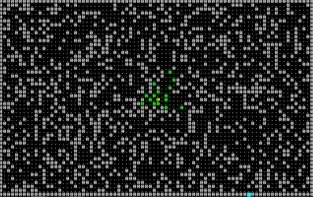
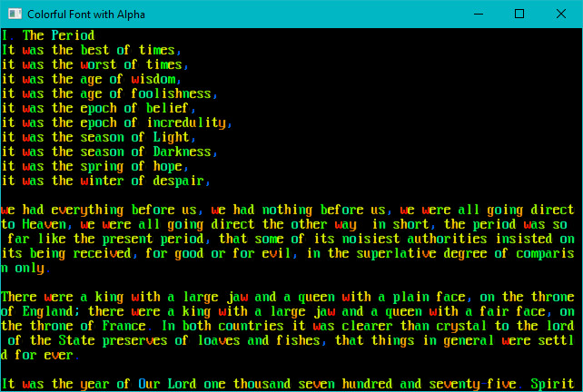
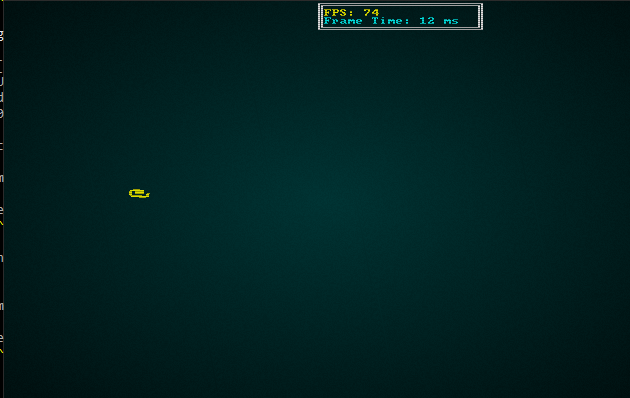
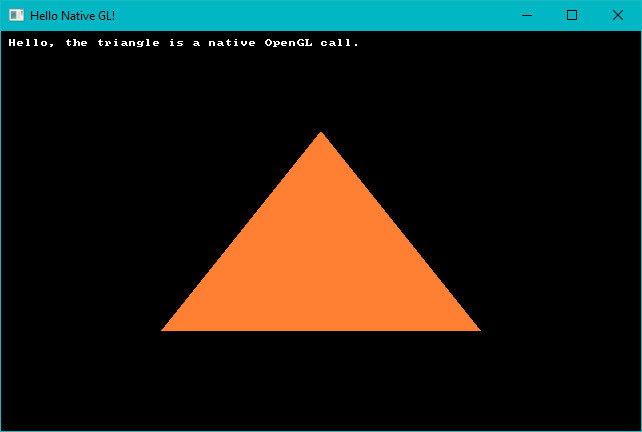
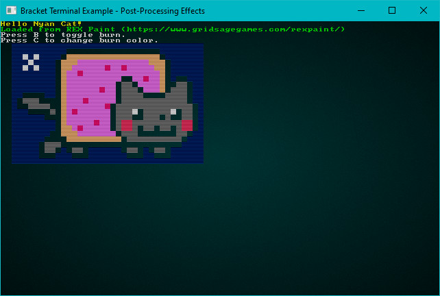
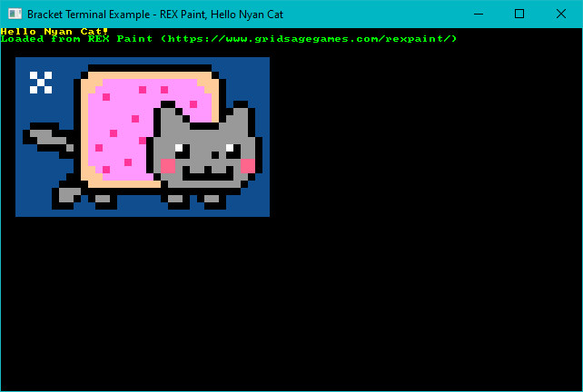
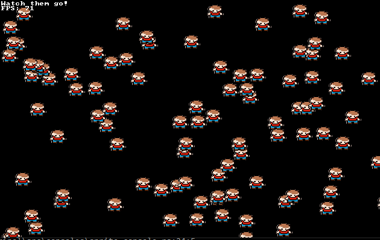
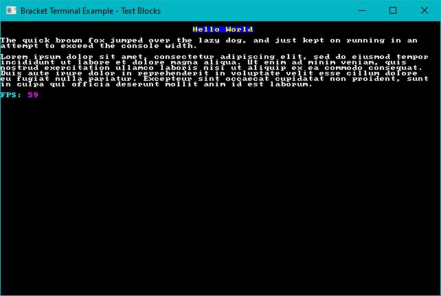
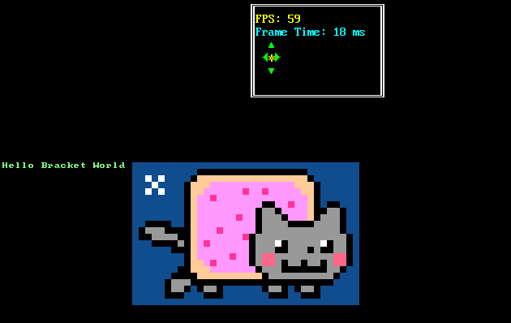
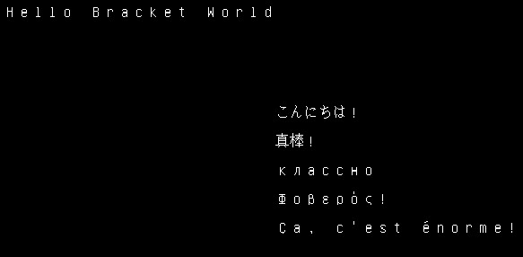

# Terminal Examples

## alpha

[Source Code](https://github.com/amethyst/bracket-lib/blob/master/bracket-terminal/examples/alpha.rs)

Demonstrates the RGBA capabilities of the library, when alpha blending is enabled on a sparse console overlaying a simple console. Also uses the `VirtualConsole` feature to create a large psuedo-console containing a chunk of *A Tale of Two Cities*, and rendering that as the base layer.

## astar_mouse

[Source Code](https://github.com/amethyst/bracket-lib/blob/master/bracket-terminal/examples/astar_mouse.rs)

Generates a random blob map, and places a player on it. The player moves to wherever the mouse is clicked, using A star pathfinding. Also generates real-time field of view for the player as they zip around.

## bench_scalable

[Source Code](https://github.com/amethyst/bracket-lib/blob/master/bracket-terminal/examples/bench_scalable.rs)

Generates a completely random console, as fast as possible. Uses the resizable console option to allow the window to be resized while it runs, and queries the console for dimensions---filling as much of it as possible.

No screenshot, sorry.

## benchmark

[Source Code](https://github.com/amethyst/bracket-lib/blob/master/bracket-terminal/examples/benchmark.rs)

Draws a random console as fast as possible. No resizing.

## colorfont

[Source Code](https://github.com/amethyst/bracket-lib/blob/master/bracket-terminal/examples/colorfont.rs)

Demonstrates that you can use color in your font graphic if you want to.

## dwarfmap

[Source Code](https://github.com/amethyst/bracket-lib/blob/master/bracket-terminal/examples/dwarfmap.rs)

An homage to *Dwarf Fortress*. Generates a 3D map, and then renders it top-down with darkening for lower than the player z-levels. Implements a-star pathing in 3D, and mouse-based navigation.

## flexible

[Source Code](https://github.com/amethyst/bracket-lib/blob/master/bracket-terminal/examples/flexible.rs)

Demonstrates using a fancy/flexible console to make a spinning `@` bounce around the screen.

## fontswitch

[Source Code](https://github.com/amethyst/bracket-lib/blob/master/bracket-terminal/examples/fontswitch.rs)

Demonstrates switching fonts at run-time.

## hello_minimal

[Source Code](https://github.com/amethyst/bracket-lib/blob/master/bracket-terminal/examples/hello_minimal.rs)

Minimal hello world, see the quick start guide.

## hello_terminal

[Source Code](https://github.com/amethyst/bracket-lib/blob/master/bracket-terminal/examples/hello_terminal.rs)

See the quick start guide---a bouncing hello world.

## input_harness

[Source Code](https://github.com/amethyst/bracket-lib/blob/master/bracket-terminal/examples/input_harness.rs)

A handy tool to display the key code and mouse information about keys/mouse as they are utilized. Also demonstrates the `advanced_input` system, providing inputs as a stream of events rather than a simple set.

## keyboard

[Source Code](https://github.com/amethyst/bracket-lib/blob/master/bracket-terminal/examples/keyboard.rs)

Mostly a debugging tool. Demonstrates keys and their various modifier combiantions.

## native_gl

[Source Code](https://github.com/amethyst/bracket-lib/blob/master/bracket-terminal/examples/native_gl.rs)

Demonstrates how to access the underlying OpenGL system, if you should need it. Note that if you really want to write a GL application, this is a really inefficient way to do it---but it gets you started, and offers a way to perform quick OpenGL calls if you just need something fancy.

## no_cls

[Source Code](https://github.com/amethyst/bracket-lib/blob/master/bracket-terminal/examples/no_cls.rs)

Mostly a debugging tool, this example shows that consoles accumulate data if you don't call `cls`. This was important for debugging the native console implementations and their dirty-render detection.

## post_process

[Source Code](https://github.com/amethyst/bracket-lib/blob/master/bracket-terminal/examples/postprocess.rs)

Demonstrates reading a REX Paint file (.xp), and rendering it to the screen. Enables or disables the terminal's post-processing options, screen-burn and uses scan-lines.

## return_error

[Source Code](https://github.com/amethyst/bracket-lib/blob/master/bracket-terminal/examples/return_error.rs)

Demonstrates how to return and act on errors from initialization, should you wish to do so.

## rex

[Source Code](https://github.com/amethyst/bracket-lib/blob/master/bracket-terminal/examples/rex.rs)

Loads Nyan Cat from an embedded REX Paint file, and renders it to the screen.

## sparse

[Source Code](https://github.com/amethyst/bracket-lib/blob/master/bracket-terminal/examples/sparse.rs)

Demonstrates layering a sparse console on top of a simple console, with different fonts on each.

## sparse_cls

[Source Code](https://github.com/amethyst/bracket-lib/blob/master/bracket-terminal/examples/sparse_cls.rs)

Debugging tool, designed to help me notice when I break clearing sparse consoles again!

## sprites

[Source Code](https://github.com/amethyst/bracket-lib/blob/master/bracket-terminal/examples/sprites.rs)

Uses the sprite layer type (in its infancy) to animate some sprites as they run around the screen.

## squishy

[Source Code](https://github.com/amethyst/bracket-lib/blob/master/bracket-terminal/examples/squishy.rs)

A benchmark tool that also demonstrates the ability to "squish" terminals by dynamically resizing the size of each tile.

## textblock

[Source Code](https://github.com/amethyst/bracket-lib/blob/master/bracket-terminal/examples/textblock.rs)

Demonstrates the text-block tool, and how it can help with large amounts of text.

## textsprites

[Source Code](https://github.com/amethyst/bracket-lib/blob/master/bracket-terminal/examples/textsprites.rs)

Demonstrates the "multi-tile text sprite" system. You can batch some characters together for quick rendering.

## tiles

[Source Code](https://github.com/amethyst/bracket-lib/blob/master/bracket-terminal/examples/tiles.rs)

Uses graphical fonts instead of ASCII/CP437 for a visual dungeon experience.

## unicode

[Source Code](https://github.com/amethyst/bracket-lib/blob/master/bracket-terminal/examples/unicode.rs)

Demonstrates that if you *really* want to (it's slow!), you can load a giant font containing lots of unicode and display multi-lingual terminals. Run this one in `release` mode. It takes far too long to start, otherwise.

## virtual_console

[Source Code](https://github.com/amethyst/bracket-lib/blob/master/bracket-terminal/examples/virtual_console.rs)

Demonstrates using a virtual console to hold a lot of data, and then displaying windows into the virtual console. This can be handy for logs, manuals and similar. *This should have a seizure warning*

## walking

[Source Code](https://github.com/amethyst/bracket-lib/blob/master/bracket-terminal/examples/walking.rs)

Demonstrates walking around a map.

## walking_with_is_pressed

[Source Code](https://github.com/amethyst/bracket-lib/blob/master/bracket-terminal/examples/walking_with_is_pressed.rs)

The same walking demo, but using the `is_pressed` function (for advanced input) rather than the simple key enum.
