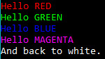
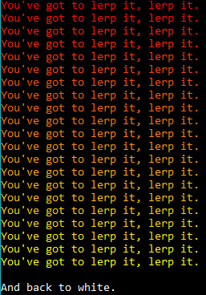
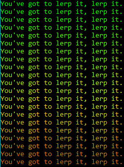
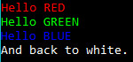
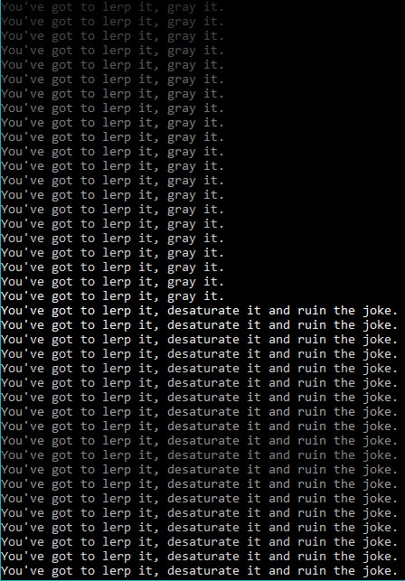

## Bracket-Color Examples

All of the `bracket-color` examples require `crossterm` for console output. You can run them with:

~~~
cd bracket-color
cargo run --example (name) --no-default-features --features crossterm
~~~

### colors

[Source Code](https://github.com/amethyst/bracket-lib/blob/master/bracket-color/examples/colors.rs).

The `colors` example demonstrates printing to the console in a number of colors, demonstrating several of the ways in which colors can be generated (named, from floating point and byte RGB).

### lerp

[Source Code](https://github.com/amethyst/bracket-lib/blob/master/bracket-color/examples/lerp.rs)

The `lerp` example shows how to use the `lerp` function, providing smooth transitions between two colors. The transition occurs in the RGB space. You can use HSV colors to lerp in that space if you wish. ("Lerp" is a common shorthand for "Linear Interpolation")

### lerpit

[Source Code](https://github.com/amethyst/bracket-lib/blob/master/bracket-color/examples/lerpit.rs)

Similar to the `lerp` example, but using an iterator instead of repeated calls to the `lerp` function. `Bracket-color` includes an `RgbLerp` iterator for this purpose.

### lerpit_hsv

[Source Code](https://github.com/amethyst/bracket-lib/blob/master/bracket-color/examples/lerpit_hsv.rs)

This is just like the `lerpit` example, but using an HSV color space for interpolation via the `HsvLerp` iterator.

### named_color

[Source Code](https://github.com/amethyst/bracket-lib/blob/master/bracket-color/examples/named_color.rs)

A very simple demo printing colors obtained via `RGB::named`, including a quick test of the `into` conversion between colors.

### shades_of_grey

[Source Code](https://github.com/amethyst/bracket-lib/blob/master/bracket-color/examples/shades_of_grey.rs)

This demo shows off how to use `to_greyscale()` and `desaturate()` on colors, providing two different methods of converting colors to greyscale.

