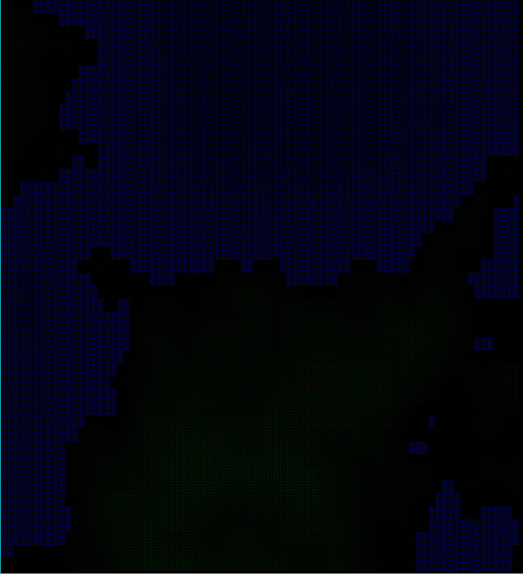
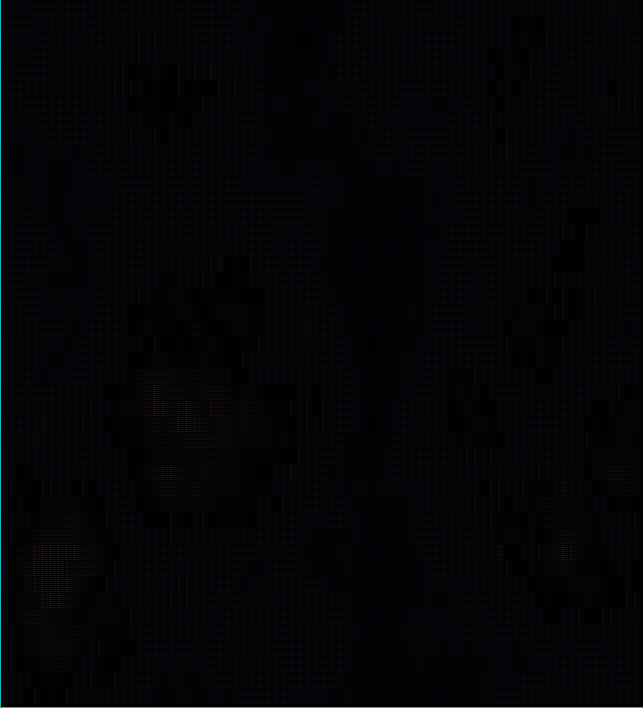
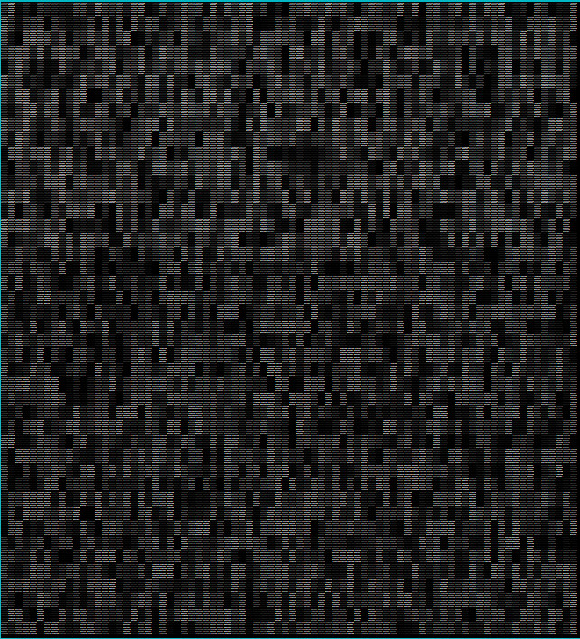

## Bracket-Noise Examples

### cellular

[Source Code](https://github.com/amethyst/bracket-lib/blob/master/bracket-noise/examples/cellular.rs)

Note that this is *not* cellular automata! Generates *cellular* noise, basically a randomized Voronoi pattern.

### perlin_fractal

[Source Code](https://github.com/amethyst/bracket-lib/blob/master/bracket-noise/examples/perlin_fractal.rs)

This example uses Perlin Fractal Noise to generate an ASCII height map.

### simplex_billow_quintic

[Source Code](https://github.com/amethyst/bracket-lib/blob/master/bracket-noise/examples/simplex_billow_quintic.rs)

This examples uses Simplex noise to make a heightmap, using the Billow and Quintic modes.

### simplex_fractal

[Source Code](https://github.com/amethyst/bracket-lib/blob/master/bracket-noise/examples/simplex_fractal.rs)

This example uses Simplex noise in Fractal mode to make a heightmap.

### simplex_rigid_hermite

[Source Code](https://github.com/amethyst/bracket-lib/blob/master/bracket-noise/examples/simplex_rigid_hermite.rs)

This example uses Simplex noise in Rigit Hermite mode to make a heightmap.

### value

[Source Code](https://github.com/amethyst/bracket-lib/blob/master/bracket-noise/examples/value.rs)

This example uses value noise for simple interpolation.

### value_fractal

[Source Code](https://github.com/amethyst/bracket-lib/blob/master/bracket-noise/examples/value_fractal.rs)

This example uses value noise in fractal interpolation mode.

### whitenosie

[Source Code](https://github.com/amethyst/bracket-lib/blob/master/bracket-noise/examples/whitenoise.rs)

Generates a really random looking field of white noise. Perfect for snow, or for feeding random data to a shader.

