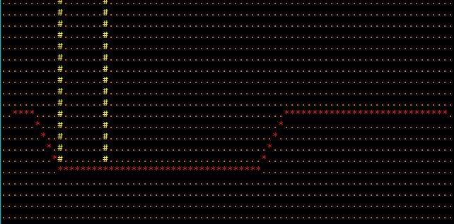

## Bracket-Pathfinding Examples

### astar

[Source Code](https://github.com/amethyst/bracket-lib/tree/master/bracket-pathfinding/examples/astar)

A quick demonstration of A-star pathfinding in action. Demonstrates the minimum required for accurate A-star pathing.

### astar_manhattan

[Source Code](https://github.com/amethyst/bracket-lib/tree/master/bracket-pathfinding/examples/astar_manhattan)

Demonstrates using Manhattan distances in A-Star, rather than regular Pythagoras.

### dijkstra

[Source Code](https://github.com/amethyst/bracket-lib/tree/master/bracket-pathfinding/examples/dijkstra)

Demonstrates the usage of the Dijkstra maps feature by brightening areas close to starting points, and darkening those further away.

### fov

[Source Code](https://github.com/amethyst/bracket-lib/tree/master/bracket-pathfinding/examples/fov)

Demonstrates the Field-of-View functionality.

